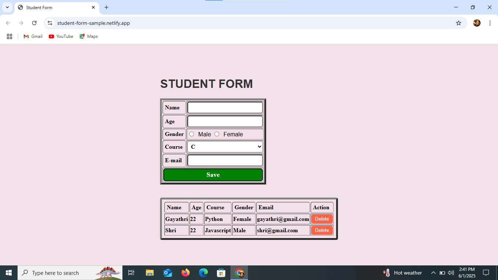

# Student Registration Form - Web Project

A simple interactive student registration form built using **HTML**, **CSS**, and **JavaScript**. This form allows users to input student details and dynamically display and delete records from a table on the same page.

## Features

- Collects basic student information:
  - Name
  - Age
  - Gender
  - Course
  - Email
- Data validation to ensure all fields are filled
- Dynamically adds submitted data to a result table
- Includes a **Delete** button to remove individual entries
- Styled using modern CSS with hover effects

## Technologies Used

- **HTML5** – Structure of the form and table  
- **CSS3** – Styling and responsiveness  
- **JavaScript** – DOM manipulation, data validation, and interactivity

## Screenshots

## How to Run the Project

1. Clone or download this repository.  
2. Open `index.html` in any modern web browser.  
3. Fill in the student form and click **Save** to view the data in the table.

## Example Workflow

1. User enters:  
   - `Name`: John Doe  
   - `Age`: 21  
   - `Gender`: Male  
   - `Course`: Python  
   - `Email`: john.doe@example.com  
2. Click **Save**  
3. Entry appears in the table with a **Delete** button  
4. Click **Delete** to remove the entry  

## Acknowledgements

This project is built for learning front-end web development basics.

